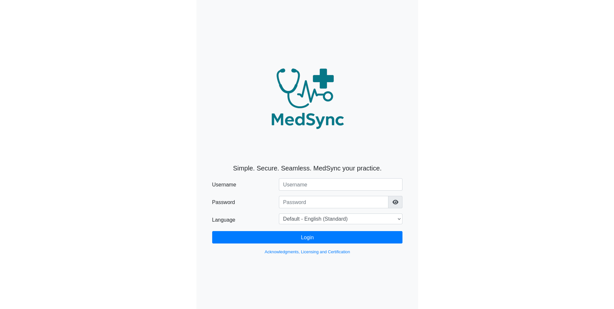
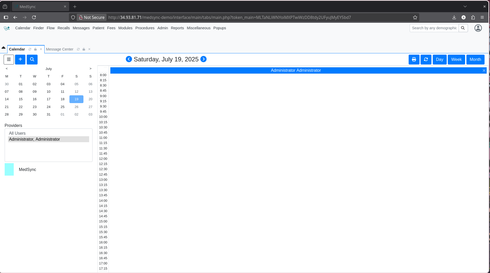
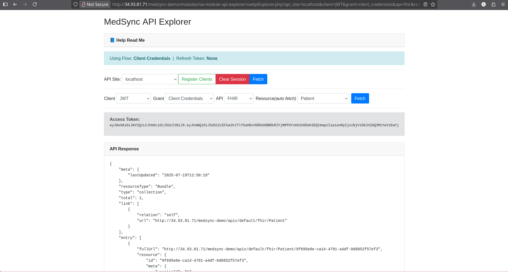

# MedSync (Based on OpenEMR)

**MedSync** is a MedTech research project by three students - Sriyam Dasgupta, Sayan Pal and Ankit Kumar, focused on improving patient data flow in Indian hospitals. Built on OpenEMR and deployed on Google Cloud, it includes API integration and OAuth-based authentication.

---

## 🔧 Team Members

- **Sayan Pal**
- **Sriyam Dasgupta** 
- **Ankit Kumar** 

---
**Try it out:** [Live Demo](http://34.93.81.71/medsync-demo)

## 🔐 Demo Credentials

|  Role |    Username    |     Password     |
|-------|----------------|------------------|
| Admin | `UNN-admin-08` | `Admin@2024open` |

> **Note:** These credentials are for demonstration purposes only. Do not use them in production environments.

---

## 🚀 Features

- Custom API module based on `oe-module-api-explorer` : [Here](http://34.93.81.71/medsync-demo/modules/oe-module-api-explorer/client_register.php?regen=1&api_site=localhost)
- Secure OAuth-based authentication
- Modular architecture for easy deployment
- Runs on Ubuntu VM, tested with Apache2 + MySQL

## 📸 Screenshots

### Login Page  


### Dashboard  


### API Explorer (Custom Module by Jerry Padgett) 

---

## 🧑‍💻 How to Contribute

MedSync builds upon OpenEMR and welcomes developers, students, and healthcare technologists to contribute. Check out the original [OpenEMR CONTRIBUTING.md](https://github.com/openemr/openemr/blob/master/CONTRIBUTING.md) for development guidelines.

---

## 📚 Resources

- [OpenEMR Docs](https://open-emr.org/wiki/index.php/Main_Page)
- [OpenEMR Forums](https://community.open-emr.org/)
- [API Explorer Docs](modules/oe-module-api-explorer/README.md) *(custom module by Jerry Padgett)*

---

## 🐞 Reporting Issues

For bugs, suggestions, or feature requests, open an issue via the [GitHub Issues tab](https://github.com/sayanx64/medsync-demo/issues).  
You can also join the discussion on the [OpenEMR Community Chat](https://www.open-emr.org/chat/).

---

## 🧪 Developer Setup

```bash
composer install --no-dev
npm install
npm run build
composer dump-autoload -o
